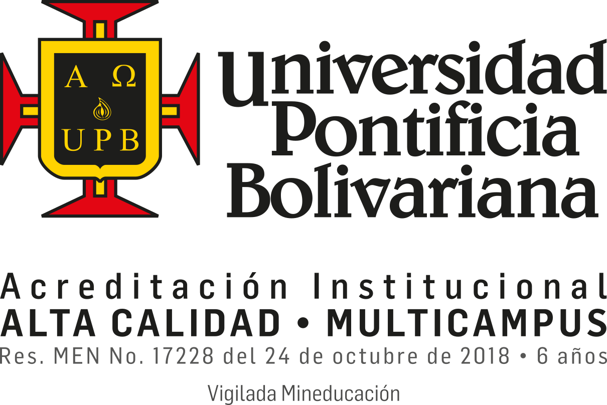

# LaTeX template for writing theses at Universidad Pontificia Bolivariana

This repository contains the LaTeX class (.cls) for writing your thesis at UPB, v2.

This is the new version of upbthesis.cls that is more book-like: v2.0.  
This version organizes the thesis by chapters and, optionally, by parts.
  
Written by: Juan A. Ramírez-Macías.  
Universidad Pontificia Bolivariana.  
2019.  

The file you require is **upbthesis.cls**.

In this folder you can find the following files:
- **upbthesis.cls**: this is the LaTeX class you want.
- upbthesis.tex: a minimal .tex template.
- upbthesis.bib: this .bib database is used to create a bibliografy; it is used by the examples.
- upbthesis.pdf: the output .pdf produced by compiling upbthesis.tex, a not-so-essential file ;).
- upbthesis_manual.pdf: a manual that explains upbthesis.cls.
- upbthesis_manual.tex: the manual's source .tex.